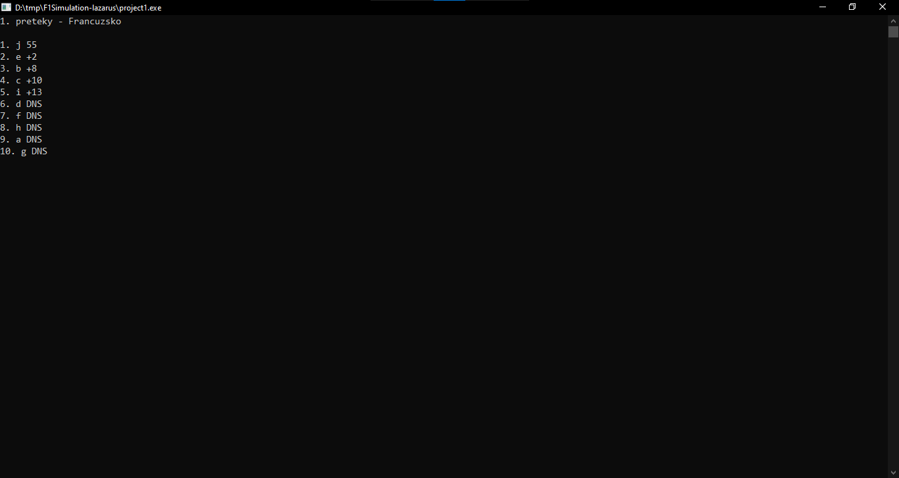

# F1 Racing Simulator

F1 Racing Simulator is a simple text-based program that simulates Formula 1 races. The program conducts races in three different locations, records lap times, and calculates the overall results for each racer.

## Features

### Racers

-   The program simulates races with 10 racers, each identified by a unique ID and represented by a letter (a-j).
-   Racers have names, lap times, and race scores.

### Races

-   Three races are simulated in different locations: Francuzsko, Madarsko, and Abu Dhabi.
-   Each race consists of 30 laps, with lap times influenced by random factors.

### Race Simulation

-   Lap times are generated randomly, with a slight chance of a racer not finishing the race (DNS - Did Not Start).
-   The program displays the progress of the race after each lap, showing racer positions and their lap times.

### Overall Results

-   After completing all races, the program calculates and displays the overall results based on race scores and total race times.
-   The top three racers are highlighted with their scores and positions.

## How to Run

1. **Compile and Run:**

    - Compile the program using a Pascal compiler.
    - Run the compiled executable.

2. **Simulation Progress:**

    - The program simulates races in three locations sequentially: Francuzsko, Madarsko, and Abu Dhabi.
    - After each race, press any key to proceed to the next race.

3. **Overall Results:**

    - After completing all races, the program displays the overall results.
    - The top three racers are highlighted with their scores and positions.

4. **Exit:**
    - Press any key to exit the program after viewing the overall results.

## Screenshots

Enjoy the excitement of F1 racing simulation and see which racers dominate the overall results!
